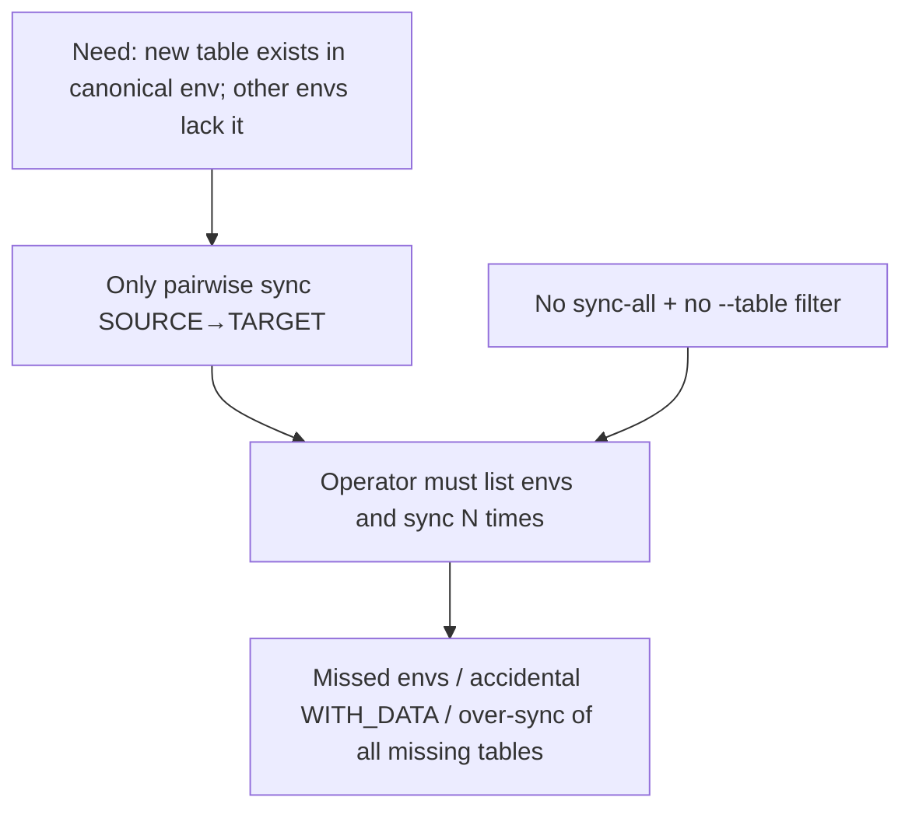

# Audit — Fan-out “add missing tables to all envs” in db_management — 2026-07-28

**Environment:** FinanceDatabase tooling (`dbase/database`); all MySQL environments registered in `master_config.database_configs`. Not a runtime trading bug.

**Primary evidence:** Static code — `dbase/database/db_management.py` (`diff_environments`, `sync_environment_from_source`, `sync_missing_tables_*`, CLI/`Makefile`); `dbase/database/README.md` sync docs. MCP MySQL unavailable at audit time (no live env count).

**Scope:** Feasibility of adding a make/CLI path that propagates a new table (or all missing tables) from one source environment to **every** other environment — not only a single `SOURCE_ENV` → `TARGET_ENV` pair. Follow-up: **[fix-checklist.md](./fix-checklist.md)** (deferred until open questions answered).

**Fix already in tree (verify deployed):** None. Pairwise sync already exists.

---

## Executive summary

**Feasible — and mostly a thin loop over existing primitives.** There is no `make run` and no fan-out target today. `make sync` / `sync-apply` and `python -m dbase.database.db_management sync` only accept one `--source-env` and one `--target-env`. The hard work (diff, `CREATE TABLE … LIKE`, optional data copy, dry-run default) already lives in `sync_environment_from_source` / `sync_missing_tables_between_databases`.

The gap is **orchestration + safety**, not schema mechanics:

1. No “all targets” loop over `list_environments()`.
2. No `--table` filter — sync applies **every** table missing in the target for shared base names, which is broader than “add this one table.”
3. Blast radius is high if `--apply` / `WITH_DATA=1` fans out without excluding protected envs and without dry-run first.

**Recommended ship shape:** add `sync-all` (dry-run default) that calls existing sync per target env, exclude protected + source, optional `--table` / `--base-name` filters, then Makefile wrapper. Do **not** invent a new clone path.

---

## Primary code defect

Capability gap: CLI/Makefile expose only pairwise sync; there is no fan-out over `list_environments()` and no table-name filter on the existing sync path.

**Location:** `dbase/database/db_management.py:1250-1272` (sync CLI args) + `dbase/database/Makefile:75-83` (sync targets). Primitives to reuse: `list_environments` (`:512`), `sync_environment_from_source` (`:914`), `sync_missing_tables_between_databases` (`:817`).

**Default patch scope:** One checklist item (one PR) unless user expands — thin `sync-all` wrapper + optional `--table` filter + Makefile/`README` docs. Defer multi-env parallel apply, column-level ALTER sync, and prod-as-target unless explicitly requested.

---

## Resolution (tiered)

| Action | Tier | Location | Notes |
|--------|------|----------|-------|
| Add `sync_all_environments_from_source(...)` looping `list_environments(exclude_prod=True)`, skip source, call existing sync per target; dry-run unless `apply=True` | `P0-code` | `db_management.py` near `:914` | Reuse; do not reimplement CREATE TABLE |
| CLI `sync-all` + Make `sync-all` / `sync-all-apply` (`SOURCE_ENV` required) | `P0-code` | `build_cli_parser`, `Makefile`, `README.md` | Mirror pairwise sync UX |
| Optional `--table` / `--base-name` filters so “add one table” does not create every other missing table | `P0-code` | filter inside sync helpers or fan-out loop | Without this, fan-out is too blunt for the stated use case |
| Unit tests: dry-run lists targets; apply mocked; protected envs skipped | `P0-code` | `tests/test_db_management_*.py` | No live MySQL required if mocked |
| Explicit `--include-protected` / refuse syncing *into* protected targets without confirm | `EPIC` | sync-all safety | Protected list is env-var driven; empty by default |
| Column/index drift sync (`ALTER`, not only missing tables) | `EPIC` | new diff dimension | Out of scope of current `EnvironmentDiff` |
| Parallel apply across targets | `EPIC` | performance | N envs × M tables is fine sequentially for current scale |
| Ops runbook: create table once in canonical env, then `sync-all` | `ops` | README | Canonical today: `long_bbands_v2` for bot-config shape |
| One-off shell loop without code change | `ops` | operator | Acceptable interim; error-prone |

---

## 1. Current behavior — pairwise only

### What exists

| Capability | API / Make | Behavior |
|------------|------------|----------|
| List envs | `list` / `list_environments` | Active envs from registry; can exclude protected |
| Diff one pair | `diff` / `diff_environments` | Missing DBs + tables in target vs source |
| Sync one pair | `sync` / `sync-apply` | Dry-run default; `--apply` creates missing DBs + tables |
| Create one empty DB | `create-db` | No table DDL |
| Clone full env | `create-env` | Full schema (or +data) from source — not “one table” |

### Mechanism (sync path)

1. `diff_environments(source, target)` loads base→physical maps, then `set(source_tables) - set(target_tables)` per shared base.
2. On apply: `CREATE TABLE IF NOT EXISTS target.tbl LIKE source.tbl`; optional `INSERT … SELECT *`.
3. No filter by table name; no loop over other environments.

### Gap vs requested feature

| Interpretation of “all dbs” | Supported today? |
|-----------------------------|------------------|
| A. All **environments’** copies of the same base (e.g. every `portfolio_data_*`) | No — must repeat sync per target |
| B. All **base_names** inside one environment | Partially — sync already covers every shared base in that pair |
| C. Literally every schema on the MySQL server (incl. system DBs) | No — and must stay no (`Database.EXCLUDED_DATABASES`) |

Prior chat intent matches **A** (propagate schema after adding a table in a canonical env).

---

## 2. Design options

| Option | Approach | Pros | Cons |
|--------|----------|------|------|
| **A — Thin fan-out (recommended)** | Loop targets; call `sync_environment_from_source` | Minimal code; dry-run/apply/with-data reuse | Without `--table`, over-syncs unrelated missing tables |
| **B — Table-scoped fan-out** | A + `--table` / `--base-name` | Matches “add this table” | Small API surface change on helpers |
| **C — Ops-only shell** | `for env in $(make list); do make sync-apply …; done` | Zero code | No dry-run rollup; easy to hit wrong env; no protected guard in loop |
| **D — New DDL propagator** | Custom CREATE from SQL file to all physical DBs | Independent of source env | Duplicates LIKE path; bypasses env registry; higher risk |

**Recommendation:** **B** (A + filters). Implementation cost is low because `sync_missing_tables_between_databases` already takes an explicit `tables: list[str]`.

---

## Root-cause chain

---

## Contributing issues

| Issue | Location | Effect |
|-------|----------|--------|
| Sync CLI requires single `--target-env` | `db_management.py:1255-1256` | No fan-out |
| Sync applies all missing tables | `diff_environments` + `sync_missing_tables_from_environment` | “Add one table” can create many |
| `DB_PROTECTED_ENVIRONMENTS` empty unless set | `get_protected_environments` | Fan-out may include prod-like envs if registry lists them and protect list unset |
| Sync into missing DBs clones whole DB | `create_missing_databases_from_environment` | Fan-out with `sync_databases=True` heavier than “one table” |
| No audits/tests for sync helpers | `tests/` has create/create-db only | Regression risk for new fan-out |

---

## Safety constraints (must ship with P0)

1. **Dry-run default** — same as pairwise sync; Make `sync-all` ≠ apply.
2. **Skip source env**; **skip protected** via `list_environments(exclude_prod=True)`.
3. **Default `sync_databases=False` on fan-out** (or require explicit flag) — “add a table” should not create whole missing databases unless asked.
4. **Default schema-only** — `WITH_DATA` / `--with-data` opt-in only.
5. **Rollup report** — per-target synced/failed/skipped so operators see partial success.
6. **`--table` filter** — required for the stated use case; otherwise document that fan-out means “full missing-table sync.”

---

## Open questions

1. **Target set:** All non-protected envs, or an explicit `--targets` / exclude list? → default **EPIC** if exotic; P0 can use `list_environments(exclude_prod=True)`.
2. **Should fan-out create missing databases** when a base exists in source but not target? → default **no** for “add table” UX (`sync_databases=False`); full env parity stays pairwise `sync-apply`.
3. **Is `--table` mandatory or optional?** → recommend optional but documented; if omitted, sync all missing tables (current pairwise semantics).
4. **Canonical source:** Always `long_bbands_v2` / `prod`, or free `--source-env`? → free `SOURCE_ENV` (match pairwise).
5. **Prod as target:** Ever allow applying into `prod` via fan-out? → default **ops/EPIC**: refuse unless `--include-protected` + confirm.
6. **Column drift:** In scope? → **EPIC** (missing tables only today).

---

## Follow-up

| Tier | Doc |
|------|-----|
| P0-code | [fix-checklist.md](./fix-checklist.md) — write after open questions 1–3 settled (or user says ship defaults above) |
| EPIC | Protected-target confirm, ALTER/column sync, parallel apply |
| ops | Interim shell loop; README canonical-source runbook |

**Suggested defaults if user says “ship it” without answering OQs:**

- Targets = `list_environments(exclude_prod=True)` minus source  
- `sync_databases=False`  
- `--table` optional  
- Dry-run default; Make `sync-all-apply` for apply  
- Schema-only unless `WITH_DATA=1`
